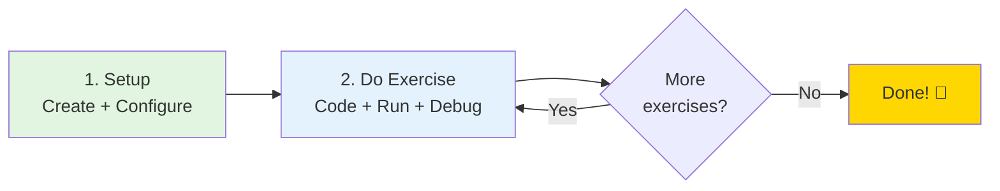

# GitHub Codespaces Quick Start Guide

Welcome to the ML Workflow Exercises Codespace! This guide will help you get started in 5 minutes.

## Quick Decision Guide

**Choose your path:**

- **First time here?** → Start with "First Time Setup" below
- **Environment not working?** → Jump to "Common Issues"
- **Ready to start exercises?** → Go to "Working with Exercises"
- **Need specific lesson help?** → See "Lesson-Specific Instructions"
- **Running out of credits?** → Check "Free Tier Limits"
- **Want to save your work?** → See "Saving Your Work" in Tips & Best Practices

### Your Learning Journey



**That's it. Three steps:**

1. **Setup** (once, 10 min): Create codespace → Add W&B key → Rebuild
2. **Do exercises** (repeat 16 times): Navigate to exercise folder → Run `conda env create -f conda.yml` → Code → Test → Debug
3. **Done**: Complete all 16 exercises across 5 lessons

**Pro tip**: One codespace is enough for all exercises. Switch branches with `git checkout` when needed.

---

## First Time Setup

### 1. Create Your Codespace

#### Choosing Your Branch

Before creating your codespace, you need to choose which branch to work from:

**Recommended Options:**

| Branch | When to Use | Best For |
|--------|-------------|----------|
| **`master`** | Starting fresh, following course exercises | Most students - stable, tested infrastructure |
| **`main`** | If this is the default branch | Alternative to master (some repos use main) |
| **Feature branch** | Working on specific improvements or experiments | Advanced users testing new features |

**How to Create:**

1. Navigate to the repository on GitHub
2. **Important**: First select your desired branch using the branch dropdown (top-left, usually shows "master" or "main")
3. Click the green **"Code"** button
4. Select the **"Codespaces"** tab
5. Click **"Create codespace on [branch-name]"**
   - The button will show the currently selected branch
   - Double-check this matches your intended branch before clicking

**First-time Setup Time:**
- With prebuild: ~30-60 seconds
- Without prebuild: ~2-3 minutes
- The environment will auto-configure with Python 3.13, conda, MLflow, and W&B

**Pro Tips:**

- **For course exercises**: Use `master` branch - it has all infrastructure fixes and stable dependencies
- **Switch branches later**: You can change branches inside the codespace without recreating it (saves time and credits)
- **Multiple exercises**: Create ONE codespace and switch branches as needed rather than multiple codespaces

#### Switching Branches After Creation

You don't need to create a new codespace to work on a different branch. To switch branches in your existing codespace:

**Using VS Code UI:**
1. Click the branch name in the bottom-left status bar
2. Select the branch you want from the dropdown
3. Wait for files to update (a few seconds)

**Using Terminal:**
```bash
git fetch origin                    # Get latest branches
git checkout <branch-name>          # Switch to branch
git checkout master                 # Back to master
git checkout -b my-feature-branch   # Create new branch
```

**When to switch vs. create new:**

- **Switch branches**: Working on different exercises, comparing solutions, testing features
- **Create new codespace**: Need a completely fresh environment, working on isolated project

### 2. Add Your Weights & Biases API Key

**Important**: All exercises require W&B authentication.

1. Get your **v1 API key** from [https://wandb.ai/authorize](https://wandb.ai/authorize)
   - New keys have format: `wandb_v1_...` (86 characters)
   - Legacy 40-character keys are being phased out
2. In GitHub, go to **Settings** → **Codespaces** → **Secrets**
3. Click **New secret**:
   - **Name**: `WANDB_API_KEY`
   - **Value**: [paste your full v1 API key]
   - **Repository access**: Select this repository
4. **Rebuild your Codespace**: Press `Cmd+Shift+P` (Mac) or `Ctrl+Shift+P` (Windows), type "Rebuild Container", and press Enter

**Note:** This repository uses wandb 0.24.0, which supports the new secure v1 API key format.

### 3. Verify Setup

After rebuild, check the terminal output. You should see:
```
✓ WANDB_API_KEY found
✓ W&B login successful!
```

---

## Terminal Setup

### Default Shell
This Codespace uses **Zsh** as the default shell with Oh My Zsh for enhanced functionality.

### Conda Environment Auto-Activation
The `ml_workflow_base` conda environment is configured to auto-activate in new terminals.

**What you'll see when opening a new terminal:**
```
==========================================
  ML Workflow Exercises - Codespace
==========================================

Environment: Python 3.13.x, MLflow 3.3.2
Disk Space: XXG available

Quick Start:
  cd lesson-X-*/exercises/exercise_Y/solution
  conda env create -f conda.yml
  conda activate <env_name>
  mlflow run .

Docs: README.md | CODESPACES_QUICKSTART.md
```

**Verify your environment:**
```bash
# Check active environment (should show * next to ml_workflow_base)
conda env list

# Verify Python version (should be 3.13.x)
python --version

# Verify MLflow version (should be 3.3.2)
mlflow --version
```

**If auto-activation doesn't work:**
Manually activate the environment in each new terminal:
```bash
conda activate ml_workflow_base
```

### Environment Details

- **Name**: `ml_workflow_base`
- **Python**: 3.13
- **Key Packages**: MLflow 3.3.2, W&B 0.24.0, pandas 2.3.2, scikit-learn 1.7.2
- **Location**: `/opt/conda/envs/ml_workflow_base`

---

## Working with Exercises

### Lesson Structure

This repository contains 5 lessons with 16 exercises:
- **Lesson 1**: Machine Learning Pipelines (exercises 1-3)
- **Lesson 2**: Data Exploration and Preparation (exercises 4-6)
- **Lesson 3**: Data Validation (exercises 7-9)
- **Lesson 4**: Training, Validation, Experiment Tracking (exercises 10-13)
- **Lesson 5**: Final Pipeline, Release, and Deploy (exercises 14-16)

Each exercise has:
- `starter/` - Your workspace (with TODOs)
- `solution/` - Reference implementation

### Exercise Workflow

#### Navigate to Exercise
```bash
cd lesson-X-<lesson-name>/exercises/exercise_Y/solution
# Example:
cd lesson-3-data-validation/exercises/exercise_9/solution
```

#### Create Exercise Environment (First Time Only)
```bash
conda env create -f conda.yml
```

This creates a new conda environment with all dependencies. Takes ~1-2 minutes with mamba.

#### Activate Environment
```bash
conda activate <env_name>
```

The environment name is specified in `conda.yml`. Example names:
- `ex3_multi_step_env` (Lesson 1, Exercise 3)
- `ex7_env` (Lesson 3, Exercise 7)
- `ex14_env` (Lesson 5, Exercise 14)

#### Run Exercise

**MLflow projects** (most exercises):
```bash
mlflow run .
```

**pytest tests** (Lesson 3):
```bash
pytest . -v
```

**Jupyter notebooks** (Lesson 2):
```bash
jupyter lab --ip=0.0.0.0 --port=8888 --no-browser
```
Then click the Jupyter Lab link that appears.

---

## Lesson-Specific Instructions

### Lesson 1: Machine Learning Pipelines
Basic MLflow pipeline construction. Learn to chain components.

**Key exercises**:
- Exercise 2: Single component pipeline
- Exercise 3: Multi-step pipeline (download → process)

**Common commands**:
```bash
cd lesson-1-machine-learning-pipelines/exercises/exercise_3/solution
conda env create -f conda.yml
conda activate ex3_multi_step_env
mlflow run .
```

### Lesson 2: Data Exploration and Preparation
EDA with pandas-profiling, data preprocessing.

**Key exercises**:
- Exercise 4: EDA with ydata-profiling
- Exercise 5: Data preprocessing pipeline

**Jupyter workflow**:
```bash
cd lesson-2-data-exploration-and-preparation/exercises/exercise_5/solution
conda env create -f conda.yml
conda activate ex5_env
jupyter lab --ip=0.0.0.0 --port=8888 --no-browser
```

### Lesson 3: Data Validation
pytest-based data validation, statistical tests.

**Key exercises**:
- Exercise 7: Basic pytest tests
- Exercise 9: Kolmogorov-Smirnov test

**pytest workflow**:
```bash
cd lesson-3-data-validation/exercises/exercise_9/solution
conda env create -f conda.yml
conda activate ex9_env
pytest . -v --reference_artifact="..." --sample_artifact="..." --ks_alpha=0.05
```

### Lesson 4: Training & Experiment Tracking
Model training, hyperparameter tuning, W&B tracking.

**Key exercises**:
- Exercise 10: Random forest training
- Exercise 12: Experiment tracking

**Hyperparameter sweep**:
```bash
cd lesson-4-training-validation-experiment-tracking/exercises/exercise_10/solution
conda env create -f conda.yml
conda activate ex10_env
mlflow run . -P hydra_options="random_forest.n_estimators=100,200 random_forest.max_depth=10,50 -m"
```

### Lesson 5: Full Pipeline
Complete end-to-end ML pipeline with all components.

**Pipeline steps**: download → preprocess → check_data → segregate → train → evaluate

**Run specific steps**:
```bash
cd lesson-5-final-pipeline-release-and-deploy/exercises/exercise_14/solution
conda env create -f conda.yml
conda activate ex14_env

# Run specific steps
mlflow run . -P hydra_options="main.execute_steps='download,preprocess'"

# Run all steps
mlflow run .
```

---

## Common Issues

### "WANDB_API_KEY not set"
**Problem**: W&B authentication failed
**Solution**:
1. Check if you added the secret to GitHub Codespaces (Settings → Codespaces → Secrets)
2. Make sure the secret name is exactly `WANDB_API_KEY`
3. Rebuild your container (`Cmd+Shift+P` → "Rebuild Container")

### "conda: command not found"
**Problem**: Conda not activated
**Solution**: The base environment should activate automatically. If not:
```bash
source /opt/conda/etc/profile.d/conda.sh
conda activate ml_workflow_base
```

### "Disk space full"
**Problem**: Too many conda environments
**Solution**: Run the cleanup script:
```bash
bash .devcontainer/scripts/cleanup-mlflow-envs.sh
```
Or use the VS Code task: `Cmd+Shift+P` → "Tasks: Run Task" → "Cleanup MLflow Environments"

### "Environment <env_name> not found"
**Problem**: Haven't created the exercise environment yet
**Solution**: Run `conda env create -f conda.yml` in the exercise directory

### "Port 8888 already in use"
**Problem**: Jupyter Lab already running
**Solution**: Kill the existing process:
```bash
pkill -f jupyter
jupyter lab --ip=0.0.0.0 --port=8888 --no-browser
```

### Slow execution / timeouts

**Problem**: Codespace resource constraints
**Solution**:

- Close unused browser tabs
- Stop unnecessary processes
- Check which lesson you're on:
  - Lessons 1-3: 2-core should be sufficient
  - Lessons 4-5: Upgrade to 4-core (Codespace menu → "Change machine type")
  - Hyperparameter sweeps: Consider 8-core temporarily
- See "Free Tier Limits" section for machine type recommendations

### "Your local changes would be overwritten by checkout"

**Problem**: Trying to switch branches with uncommitted changes
**Solution**:

```bash
# Option 1: Save your work (recommended)
git add .
git commit -m "Work in progress on exercise X"
git checkout <target-branch>

# Option 2: Stash changes temporarily
git stash
git checkout <target-branch>
# Later, return and restore:
git checkout <original-branch>
git stash pop

# Option 3: Discard changes (use with caution!)
git checkout -- .
git checkout <target-branch>
```

### Wrong branch / Need to start over

**Problem**: Created codespace on wrong branch or environment is corrupted
**Solution**:

```bash
# Check current branch
git branch

# Switch to correct branch
git checkout master  # or main

# If environment is corrupted, delete and start fresh
conda remove --name <env_name> --all
cd lesson-X-.../exercise_Y/solution
conda env create -f conda.yml
```

Or simply delete the codespace and create a new one from the correct branch.

---

## VS Code Tasks

Access via `Cmd+Shift+P` → "Tasks: Run Task":

- **Cleanup MLflow Environments**: Free up disk space
- **Create Exercise Environment**: Run `conda env create -f conda.yml`
- **Run MLflow Project**: Run `mlflow run .` (default task)
- **Run pytest**: Run pytest with verbose output
- **Start Jupyter Lab**: Launch Jupyter on port 8888

---

## Viewing Results

### MLflow UI
When you run `mlflow run .`, the MLflow UI becomes available:
1. Check the "Ports" tab in VS Code (bottom panel)
2. Click on the "MLflow UI" link (port 5000)
3. View experiments, parameters, metrics, and artifacts

### Weights & Biases
1. Go to [https://wandb.ai](https://wandb.ai)
2. Navigate to your project (e.g., `exercise_14`)
3. View runs, artifacts, and visualizations

---

## Github Codespaces Limits

**What you get:**

- **60 core-hours/month** (free accounts)
- **180 core-hours/month** (with GitHub Student Developer Pack - get this!)

### Essential Habits

**To make your credits last:**

- **Stop when done**: Click Codespace name → "Stop codespace" (don't leave it running)
- **Auto-stop**: Set timeout to 30 minutes (GitHub Settings → Codespaces)
- **Delete old codespaces**: Keep only your active one
- **Use 2-core machine**: Sufficient for *All Lessons**
- **Switch branches instead of creating multiple codespaces** - this is the biggest credit saver

---

## Tips & Best Practices

### Environment Management
- Each exercise gets its own conda environment
- Environment names are in `conda.yml` (check `name:` field)
- List all environments: `conda info --envs`
- Remove specific environment: `conda remove --name <env_name> --all`

### Saving Your Work

**Important**: Changes you make in the codespace are not automatically saved to your GitHub account.

**Recommended workflow for saving your solutions:**

1. **Create your own branch for each lesson or exercise:**
   ```bash
   git checkout -b my-lesson-1-solutions
   # Work on exercises
   git add .
   git commit -m "Completed exercise 3"
   git push origin my-lesson-1-solutions
   ```

2. **Fork the repository first (recommended for course students):**
   - Fork the repository to your own GitHub account
   - Create codespace from YOUR fork
   - Create branches for each lesson
   - Push your work to your fork (preserves all your solutions)

3. **Compare your work with solutions:**
   ```bash
   # Save your work first
   git add .
   git commit -m "My attempt at exercise 9"

   # Switch to see solution
   git checkout master
   cd ../solution

   # Switch back to your work
   git checkout my-lesson-3-solutions
   cd ../starter
   ```

**What gets saved vs. lost:**

- ✅ **Saved**: Code you commit and push to a branch
- ✅ **Saved**: W&B artifacts (stored in cloud)
- ❌ **Lost**: Uncommitted code changes when codespace is deleted
- ❌ **Lost**: Local conda environments (need to recreate)
- ❌ **Lost**: Terminal history and running processes

### Working with Starter Files

The `starter/` directories contain TODO markers for you to implement:

- Follow exercise README.md for instructions
- Compare with `solution/` when stuck
- Both starter and solution use the same `conda.yml`

### Jupyter Notebooks
**Important**: Properly shut down Jupyter:
1. Save your work
2. File → Shut Down
3. Close browser tab
4. Kill terminal process (Ctrl+C)

**Never** just close the browser tab - this leaves Jupyter running and consuming resources.

### Port Forwarding
VS Code automatically forwards these ports:
- **5000**: MLflow UI (access via Ports tab)
- **8888**: Jupyter Lab (auto-opens in browser)
- **8889**: Jupyter Notebook (silent, for manual access)

---

## Getting Help

### Documentation
- **This file**: Quick start for Codespaces
- **README.md**: Full repository documentation
- **Exercise README.md**: Specific instructions per exercise

### Common Commands Reference
```bash
# Navigate
cd lesson-X-*/exercises/exercise_Y/solution

# Environment
conda env create -f conda.yml
conda activate <env_name>
conda info --envs
conda remove --name <env_name> --all

# Run exercises
mlflow run .
mlflow run . -P steps=download
mlflow run . -P hydra_options="param=value"
pytest . -v
jupyter lab --ip=0.0.0.0 --port=8888 --no-browser

# W&B
wandb login
wandb whoami
wandb status

# Cleanup
bash .devcontainer/scripts/cleanup-mlflow-envs.sh
```

Happy learning!
